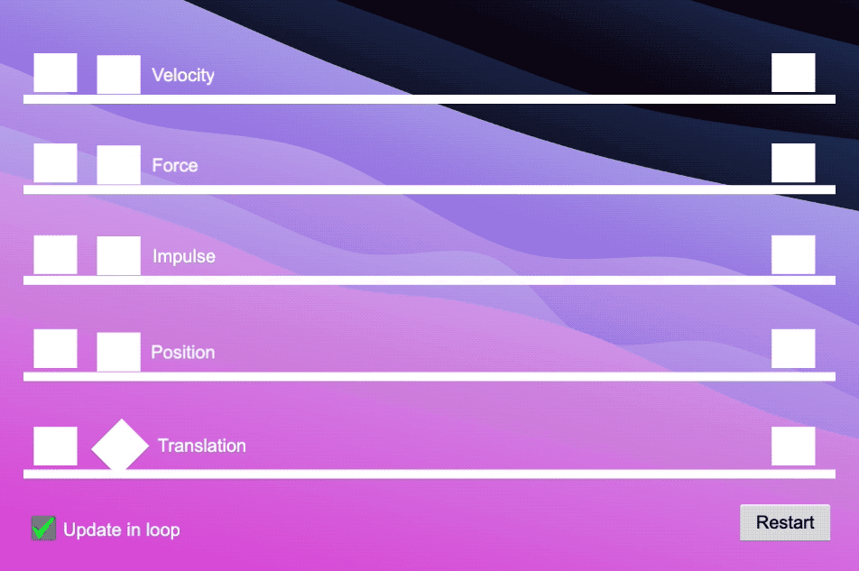

# 5 ways to move in Cocos Creator

### One of the first things you'll want to do for your game is probably to move something from point _A_ to point _B_. There are various ways to move an element in Cocos Creator, some affect the `ridigBody` and the others on the position of the `Node`, based on what you want to achieve you might chose one or another, those are the most common.

Demo here: https://tabanella.me/cocos-engine-5-ways-to-move/

Article here: https://renard.land/articles/cocos-creator/fundamentals/five-ways-to-move-in-cocos-creator/

From tutorial: https://www.youtube.com/watch?v=wi-RL4sUayo

List of subjects

- Velocity
- Translation (local and global)
- Impulse
- Force
- Position
